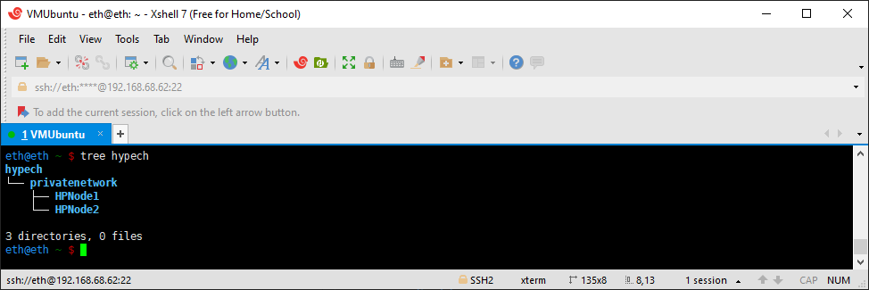

## Chapter 2. Build up one Ethereum Network at Your Home

The best learning strategy is just do it. Before we use real money to jump into the crucial Ethereum world, we will build up one mimic Ethereum network in our home. We will continue Ethereum journey after become familar with all the concepts and tricks. Find a couple of spared computers or laptops, we run build and run an Ethereum at home.

I found 3 old computers from my basement. I'm going to setup my Ethereum with them.

1. 5 years old HP Pavilion desktop with i7-8700, 16G RAM, 1T Harddrive, 120G SSD. 
2. 6 years old Macbook Pro.
3. 9 years old Lenovo V330 Laptop. 

The Windows 11 is too slow in the old computer. I changed them to Windows Server 2022 (it's not necessary if you have a faster computer or you don't mind waiting). The Windows OS is installed on the 1T harddrive. 

On top of Windows Server 2022, download VMWare Workstation 17. Create a new Virtual Machine and install Ubuntu 14.04. The virtual machine is installed on 120G SSD.

The plan is building an Ethereum network with these 3 computers, then conduct all the transactions or other functions same with real ETH2.0 network. 

We'll start from the HP Pavilion. I will set up our home private Ethereum network of two nodes in HP. Both nodes will run on the my HP Desktop. Below is a step-by-step instruction to build our own Ethereum network. 


**Table of content:**
- [Step 1. Setup Directory Structure](#directory)
- [Step 2. Hello World](#item-one)
- [First Item](#item-two)
- [Second Item](#item-three)

<a id="directory"></a>
### Step 1. Setup Directory Structure
The data directories in HP Desktop for each node will be named <span style="background-color:green">HPNode1</span> and <span style="background-color:green">HPNode2</span>. 

The HP is running Ubuntu in VMWare. After starting Ubuntu, use Xshell to connect it from Windows. 

```
mkdir hypech/
mkdir hypech/privatenetwork
mkdir hypech/privatenetwork/HPNode1
mkdir hypech/privatenetwork/HPNode2
```



Hello world content goes here

<a id="item-two"></a>
### First Item
First item content goes here

<a id="item-three"></a>
### Second Item
Second item content goes here


1. [Setup Directory Structure](#ajax)
3. [C](#c)
* [HTML and CSS](#html-and-css)
* [Javascript](#javascript)
* [MySQL](#mysql)
* [PHP](#php)
* [Scratch](#scratch)


### Ajax

* [Ajax](http://etutoriale.ro/articles/1483/1/Tutorial-Ajax/)


### C

* [Ghidul Beej pentru Programarea in Retea - Folosind socket de internet](https://web.archive.org/web/20180710112954/http://weknowyourdreams.com/beej.html) - Brian "Beej Jorgensen" Hall, Dragos Moroianu (HTML) *(:card_file_box: archived)*


Chapter 2. Hello World Ethereum POA Network on Your Own Computer

Here is an end-to-end example. We'll build up it from scratch on.
